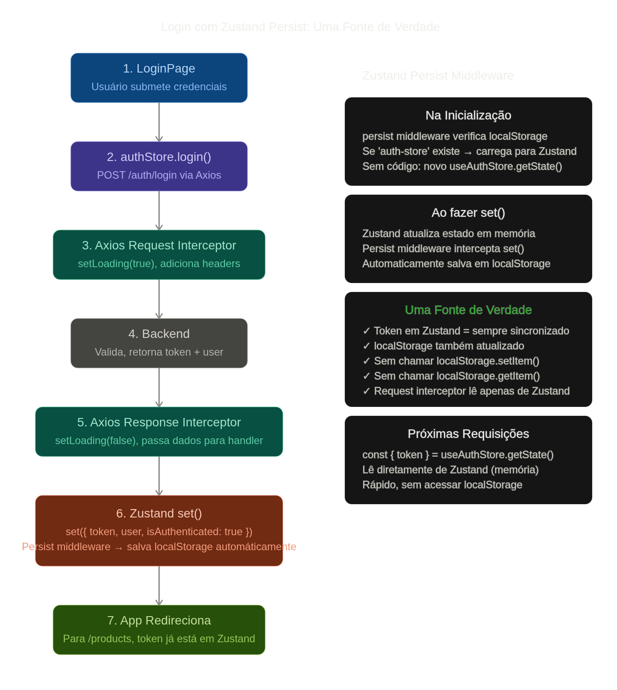

# Prova Frontend 
### Candidato: Tadeu Velloso Cabral da Silva 

## Questão 1: 

#### Estrutura de pastas

##### Para o projeto front-end proposto foi optado uma arquitetura por responsabilidades,  isolando componentes, paginas, hooks, services, store, types... a escolha da arquitetura parte do pressuposto de um projeto com poucas features, dessa forma a manutenção e evolução do projeto se mostra mais organizada e facilitada para diferentes desenvolvedores vizualizarem o código. Tive um experiência interessante a respeito de diversas arquiteturas, o projeto em que trabalhava começou a crescer muito e suas features ficaram muito grandes, o que ocasionou em race conditions e pastas com muitos files, a solução foi migrar para uma arquitetura modular, reorganizamos as pastas por features (modulos)  e dentro de cada feature separamos internamente por responsabilidades, mantivemos a lógica de separar os componentes dos hooks e querys mas em modulos especificos. Abaixo está a estrutura de pastas por responsabilidades, e a justificativa pela escolha das tecnologias escolhidas.

```
src/
│
├── pages/                          // Responsável: Composição de telas
│   ├── ProductsPage.tsx
│   ├── StockListPage.tsx
│   ├── DashboardPage.tsx
│   └── LoginPage.tsx
│
├── components/                     // Responsável: Componentes UI reutilizáveis
│   ├── common/
│   │   ├── Button.tsx
│   │   ├── Modal.tsx
│   │   ├── Card.tsx
│   │   └── Input.tsx
│   ├── layout/
│   │   ├── Header.tsx
│   │   ├── Sidebar.tsx
│   │   └── MainLayout.tsx
│   └── modules/
│       ├── ProductForm/
│       │   ├── ProductForm.tsx
│       │   └── ProductForm.styles.ts
│       ├── StockTable/
│       │   └── StockTable.tsx
│       └── DashboardCard/
│           └── DashboardCard.tsx
│
├── hooks/                          // Responsável: Lógica de negócio reutilizável
│   ├── useProducts.ts              // Gerencia dados de produtos
│   ├── useStock.ts                 // Gerencia dados de estoque
│   ├── useAuth.ts                  // Autenticação e sessão
│   ├── useProductForm.ts           // Lógica do formulário de produto
│   └── useFilters.ts               // Filtros e buscas
│
├── store/                          // Responsável: Estado global (Zustand)
│   ├── authStore.ts                // Usuário, token, autenticação
│   ├── uiStore.ts                  // Loading, toasts, modais, notificações
│   ├── productStore.ts             // Cache local de produtos
│   └── filterStore.ts              // Estado de filtros da aplicação
│
├── services/                       // Responsável: Requisições HTTP (sem lógica)
│   ├── api.ts                      // Instância axios com interceptadores
│   ├── authService.ts              // Endpoints de autenticação
│   ├── productsService.ts          // Endpoints de produtos
│   ├── stockService.ts             // Endpoints de estoque
│   ├── financialService.ts         // Endpoints financeiros
│   └── customersService.ts         // Endpoints de clientes
│
├── utils/                          // Responsável: Funções utilitárias
│   ├── formatters.ts               // Formatação de moeda, data, números
│   ├── validators.ts               // Validações de formulários
│   ├── errorHandler.ts             // Tratamento padronizado de erros
│   └── constants.ts                // Constantes da aplicação
│
├── types/                          // Responsável: Definições TypeScript
│   ├── product.ts                  // Tipos de produto
│   ├── stock.ts                    // Tipos de estoque
│   ├── user.ts                     // Tipos de usuário
│   ├── api.ts                      // Tipos genéricos de API e responses
│   └── index.ts                    // Exportações centralizadas
│
├── config/                         // Responsável: Configurações globais
│   ├── env.ts                      // Variáveis de ambiente
│   └── api.config.ts               // Configuração da instância HTTP
│
├── styles/                         // Responsável: Estilos globais
│   ├── globals.css                 // Reset e estilos base
│   ├── variables.css               // CSS variables (cores, fontes, spacing)
│   └── theme.css                   // Temas (light/dark)
│
├── assets/                         // Imagens, ícones, fontes
│   ├── icons/
│   ├── images/
│   └── fonts/
│
├── App.tsx                         // Raiz da aplicação (routing principal)
├── main.tsx                        // Entry point do React
└── vite-env.d.ts                   // Tipagem do Vite
```

##### As tecnologias escolhidas foram baseadas na complexidade proposta para realização do módulo ERP, para processamento dos dados escolhi uma combinação de tecnologias que priorizam performance, experiência propria como desenvolvedor e manutenibilidade: React com Vite como framework e build tool, Zustand para gerenciamento de estados, Context API para disponibilizar dados persistidos pelo zustand os dados de APIs, evitando assim o uso execivo de props e chamada de uma mesma query em diferentes componentes da mesma arvore. Axios para requisições HTTP, TanStack Query (React Query) para sincronização e cache inteligente de dados. No enunciado foi citado apenas o consumo das apis dos mocroserviçoes, mas acho valido colocar se houvesse a nescessidade de fazer algum criação/edição via esses mesmos serviços, o uso das libs react-hook-forms e zod/yup para validação dos dados junto aos types requeridos pelas apis previamente as requisições put/create/path.

##### A persistência do token é feita através do middleware `persist` do Zustand. Quando o usuário faz login com sucesso, o backend retorna o token, que é salvo no estado do Zustand com `set({ token })`. O middleware `persist` automaticamente sincroniza este estado com localStorage, eliminando a necessidade de gerenciar manualmente `localStorage.setItem()` e `localStorage.getItem()`. Nas proximas requisições , o Axios interceptador lê o token diretamente do Zustand e o injeta no header `Authorization: Bearer ${token}`, garantindo autenticação sem duplicação de código. Se o backend retornar 401 Unauthorized, o interceptador de response automaticamente faz logout, o Zustand persist limpa localStorage, e a aplicação redireciona para `/login`. Este padrão garante uma única fonte de verdade (Zustand) para o estado de autenticação.



###### Para tratamento de erros globais usaria os interceptadores do Axios, dessa forma toda requisição é verificada e em caso de algum erro aplicamos as regras equivalente, 401 logout como exemplo. Mas tratando todos erros http de forma equivalente com feedbacks relativos a regra de negócio, sempre preservando os dados do usuário, dessa forma mensagens muito específicas facilitariam o uso indevido ou de um usuário mal intecionado. O feedback para o usuário deve ser feito através de toasts com mensagens referentes a ação realizada, para sucesso e falha, o loadings devem ser retornados para o usuário para indicar o andamente de uma requeição assincrona que impede alguma vizualização ou ação, podendo ser mais específica ou global. O uso do react query e do zustand são fundamentais para manter a coererencia específica de cada ação. Esses recursos podem ser preventivos para excesso de requisições e prevenção de race conditions. Um provider encapsulando toda camada de componentes autorizados pelo usuario seriam protegidas por um provider que só pode renderizar seus componetes se houver o token correspondente, nessa mesma arvore que ficaria os toasts e feedbacks.


## Questão 3: 

##### O projeto está em `questao-3/`. Para rodar: `cd questao-3 && npm install && npm run dev`. A aplicação consome a Fake Store API (`https://fakestoreapi.com`) e exibe o catálogo de produtos em uma tabela com busca por texto, ordenação por título, preço e avaliação, filtro por categoria e paginação.

##### Escolha da API. Optei pela Fake Store API por ser uma das citadas no enunciado e por ter campos que rendem uma tabela de verdade: título, categoria, preço e avaliação com nota e número de votos. Antes de decidir a arquitetura, testei os endpoints um a um, e o que encontrei mudou o desenho da solução: a API **não suporta busca** (`?q=` é ignorado e devolve os 20 produtos), **não ordena por campo** (só existe `?sort=asc|desc`, que ordena por `id`, e `?sortBy=price` é ignorado) e **não pagina** (`?offset=` é ignorado; só há `?limit=` truncando do início). O que ela oferece de verdade é o filtro por categoria, com endpoint dedicado em `/products/category/:name` e a lista em `/products/categories`. Por isso a divisão do projeto é essa: **categoria vai ao servidor, busca e ordenação acontecem no cliente**. Não é preferência, é o que a API permite — e deixo explícito porque um filtro client-side sobre 20 itens é adequado, mas não escalaria para um catálogo real, onde busca e ordenação teriam que virar query params.

##### Axios em vez de fetch. A diferença que pesou foi o interceptor. Toda falha da aplicação passa por um único ponto (`src/services/api.ts`), que converte o erro em um `AppError` tipado com mensagem já em português — nenhum componente ou hook precisa importar Axios para tratar erro, e trocar a biblioteca HTTP amanhã ficaria restrito a esse arquivo. Além disso o Axios traz `baseURL` e `timeout` nativos, e trata 4xx/5xx como rejeição, enquanto o `fetch` resolve normalmente e obriga a checar `res.ok` em toda chamada — um esquecimento e o erro passa como sucesso. O `fetch` daria conta do recado num projeto desse tamanho; a escolha foi pela camada de erro centralizada, não pelo volume de requisições.

##### TanStack Query em vez de `useEffect` + `useState`. Buscar dados com `useEffect` exige escrever à mão os estados de carregando, erro e sucesso, o cancelamento em caso de desmontagem e a proteção contra resposta fora de ordem. O React Query entrega isso pronto e, principalmente, resolve dois problemas concretos aqui. O primeiro é o cache por `queryKey`: a categoria entra na chave (`['products', categoria]`), então trocar de categoria e voltar não dispara requisição nova — os dados vêm do cache, o que é a prevenção de excesso de requisições que descrevi na Questão 1. O segundo é a race condition: trocar o filtro rápido, com `useEffect`, pode fazer a resposta antiga chegar depois da nova e sobrescrever a tela; com a chave por categoria, cada resposta é guardada no seu próprio lugar e o problema deixa de existir. Usei ainda `keepPreviousData`, que mantém a tabela anterior visível enquanto a nova categoria carrega em vez de piscar para o estado de carregamento, e um retry seletivo que só repete falha de rede e 5xx — repetir um 4xx só devolveria o mesmo erro.

##### Por que as duas juntas. Não são concorrentes: o Axios é o transporte (como a requisição sai e como o erro volta normalizado) e o React Query é o gerenciamento do estado assíncrono do servidor (quando buscar, o que cachear, o que mostrar enquanto carrega). O React Query não faz requisição, ele orquestra a função que faz — e essa função é o service em Axios.

##### Onde cada requisito do enunciado está. Busca assíncrona: `src/hooks/useProducts.ts` e `src/services/productsService.ts`. Indicador de carregamento: `ProductsTableSkeleton`, que reproduz a grade da tabela para não haver salto de layout quando os dados chegam. Tratamento de erro: `src/utils/errorHandler.ts` traduz o erro por faixa de status, com mensagens propositalmente genéricas para não entregar detalhe a quem estiver sondando a API, e o `ErrorState` oferece "Tentar novamente" que chama o `refetch()` sem recarregar a página. Exibição em tabela: `src/components/modules/ProductsTable/`. Pesquisa e ordenação: `src/utils/productFilters.ts` (funções puras, fora do React, para poderem ser lidas e testadas isoladamente) consumidas por `src/hooks/useProductsFilters.ts`.

### Auxilio de AI:

- Na questão três criei um plano com o claude para execução de um projeto que vai consumir uma api publica, comuniquei no plano a escolha da api "fakestoreapi", fiz essa escolha pois achei mais facil para vizualização das reordenações e por fazer mais sentido com a sentença da questão, pedi para criar um errorHandler para tratamento de erros para tradução para o português. 